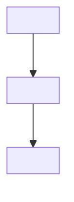

# Formatting and file templates

Everything is viewed in **Obsidian**. Write clean Markdown, not terminal output.

## Universal rules

- **Language.** Correct English by default. If metadata sets `language`, write in
  that language. Keep sentences short and clear.
- **Hard words.** If a genuinely hard word must be used, gloss it in parentheses
  right after, or in a footnote. Example: "flux (the amount flowing through a
  surface per unit time)".
- **Headings.** Use `#` for the document title, `##` for sections, `###` for
  sub-sections. One `#` per file. Blank line before and after every heading.
- **Breaks.** Blank line between paragraphs, around lists, around code, and
  around callouts. Never let two blocks touch.
- **Emphasis.** `**bold**` for key terms on first use; `*italics*` for gentle
  emphasis or a term being defined. Do not over-bold.
- **Math (LaTeX).** Inline: `$f(x)$`. Display, fenced on its own lines:

  ```md
  $$
  f(x) = x^2
  $$
  ```

  If LaTeX can be used, it should be. Write `$f(x) = x^2$`, not `f(x) = x^2`.
- **Diagrams.** SVG files live in `assets/` and are embedded by filename:
  `![[assets/<name>.svg|520]]` (width 520 is a good default; use larger for dense
  diagrams). Introduce the picture in one sentence, then let it carry the idea —
  do not narrate every element back in prose.
- **Dependency maps.** Use a `mermaid` fenced block; Obsidian renders it natively:

  ````md
  ```mermaid
  graph TD
    A[unconditional truth] --> B[derived step]
    B --> C[goal]
  ```
  ````

- **Callouts.** Use Obsidian callouts for questions and results:
  `> [!question]`, `> [!success]`, `> [!failure]`, `> [!abstract]`, `> [!info]`,
  `> [!warning]`.

## `<topic>/README.md`

```md
# <Topic>

> [!info] Session
> **Goal:** <goal>
> **Level:** <chosen level>
> **Teaching style:** <socratic / expository / adaptive>
> **Language:** <language>

## Files

- [[test]] — the adaptive test (questions and results)
- [[lesson]] — the plan and the teaching
- [[progress]] — the understanding map
```

## `<topic>/test.md`

One question block per question, followed by its result block once answered.
Question blocks never contain the answer or the correct option.

```md
# <Topic> — Understanding test

> [!abstract] How this works
> One question at a time. The question is written here; the answer options are
> shown in the terminal. This file records the question and, once you answer, the
> result.

---

## Question 1

> [!question] <Strand> · difficulty <n>/5
> <The question, clearly written. Use LaTeX and line breaks.>

<Optional short setup prose.>

![[assets/q1-<slug>.svg|520]]

> [!success] Result — correct ✓
> **Your answer:** 2. <option text>
> **Correct answer:** 2. <option text>
> **Why:** <one or two sentences>.

---
```

For a miss use `> [!failure] Result — incorrect ✗`; for no attempt use
`> [!warning] Result — I don't know`. Always include the correct answer and the
"Why" line. Difficulty is your own 1–5 estimate of the question.

## `<topic>/lesson.md`

The plan first, then the teaching appended node by node.

```md
# <Topic> — Lesson

> [!abstract] Goal
> <what the learner is reaching for>

## Plan

<A few freeform sentences: what we will cover, in what order, and why this way,
given where the learner's edge sits and what they are reaching for.>



## Node 1 — <name>

**Motivation.** <why we need this node now>

**The idea.** <establish it, motivated: how could the learner have discovered it?>

**Connection.** <how it hangs off what is already in place>

![[assets/<name>.svg|520]]   <!-- only if a picture earns its place -->

```

Repeat the node loop for every node. A picture earns its place only when it shows
something words cannot — shape, structure, direction, geometric relationship. If
prose or one equation already carries it, do not add a diagram.

## `<topic>/progress.md`

```md
# <Topic> — Understanding map

> [!info] Summary
> <one or two sentences at the end of probing: where the edge is, what to teach>

## Strands

| Strand | Floor (knows) | Ceiling (doesn't) | Edge | Misconceptions |
| --- | --- | --- | --- | --- |
| <strand> | <what they got right> | <what they missed> | <pinned edge> | <wrong models found> |

## Answer log

1. `<strand>` — difficulty <n>/5 — **correct** — <note>
2. `<strand>` — difficulty <n>/5 — **incorrect** — picked "<distractor>" — <what it reveals>
3. `<strand>` — **I don't know** — <note>
```
